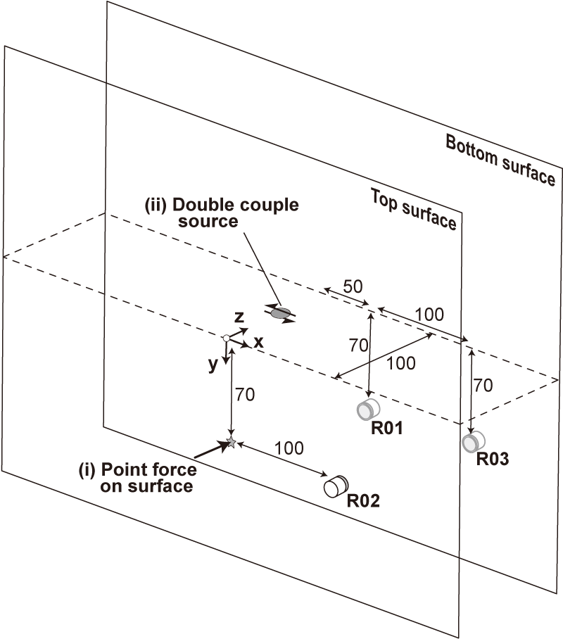

# Cross-verification of the waveform modeling

We cross-validate the waveform propagation modeling on the rock specimen using the `extended version of OpenSWPC` for laboratory and `Computer Program in Seismology`. 

## Model setup



We compute the waveforms generated by (i) a point force and (ii) a double-couple source, representing the ball-drop impact on the rock specimen surface and a seismic source on the fault, respectively.

## Extended OpenSWPC
### Environment
- HPC at NIED
- OpenSWPC forked from v5.1.0.

- Run `code/openswpc/R01`, `code/openswpc/R02`, and `code/openswpc/R03` with Green's function mode to compute the both the double couple and body force sources.

## Computer Program in Seismology

**Reference:** Herrmann, R. B. (2013) Computer programs in seismology: An evolving tool for instruction and research, Seism. Res. Lettr. 84, 1081-1088, [doi:10.1785/0220110096](https://doi.org/10.1785/0220110096).

### Installation

Follow the instruction of the [documentation](https://rbherrmann.github.io/ComputerProgramsSeismology/index.html). (Last access: March 13, 2025).

> Tips: a library path 
```sh 
export LIBRARY_PATH="$LIBRARY_PATH:/Library/Developer/CommandLineTools/SDKs/MacOSX.sdk/usr/lib"
```
> was needed before compiling the source.

### Environment
- Mac mini (M1, 2020)
- macOS Version 15.3.1 (24D70) as of March 12, 2025
- Software version `NP330.Jan-26-2025.tgz`

After compiling the sourPlease set the path to `PROGRAMS.330/bin` such as
```sh
export PATH="$PATH:/absolute/path/to/PROGRAMS.330/bin"
```

### How to run
Run `runit.sh` as follows:
```sh
cd code/herrmann96/bf
sh runit.sh
cd ../dc
sh runit.sh
```

## Plot results
After computing the Green's function from both methods, open `code/postprocess/cross_verification_comparison_master.ipynb` to plot the results.